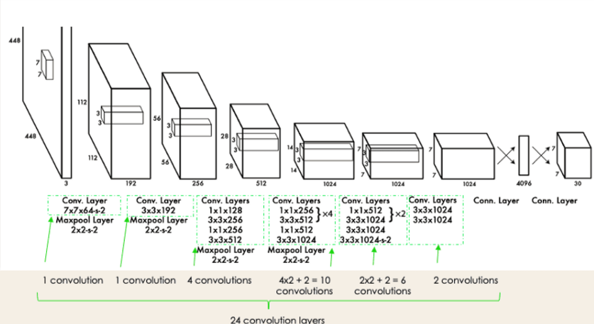
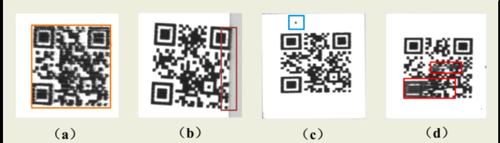
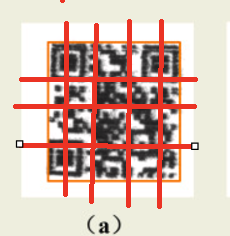
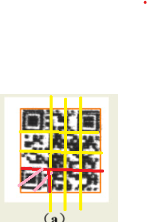

# 2D-Barcode-Detection-and-Decoding
# BarCodeVision: Intelligent 2D Barcode Detection and Decoding

BarCodeVision is a robust Python-based project designed to detect and decode 2D barcodes (like QR codes and Data Matrix) powered by YOLOv8 for object detection and Pyzbar for barcode decoding, it is ideal for applications in logistics, inventory management, and die-level traceability.

---

## Features
- **Efficient Barcode Detection**: Leverages YOLOv8, a cutting-edge object detection model, for accurate barcode localization.
- **Barcode Decoding**: Uses Pyzbar to decode detected barcodes into human-readable formats.
- **Customizable Dataset Support**: Easily upload and process custom datasets in Google Colab.
- **Visualization**: Visualize detection results with bounding boxes for validation.

---
# YOLO Object Detection

Object detection is a computer vision technique for identifying and localizing objects within an image or a video.

## Image Localization

Image localization is the process of identifying the correct location of one or multiple objects using **bounding boxes**, which correspond to rectangular shapes around the objects. 

This process is sometimes confused with **image classification** or **image recognition**, which aims to predict the class of an image or an object within an image into one of the categories or classes.

# What Makes YOLO the right choice for this task?

Some of the reasons why YOLO is right match:

- **Speed**  
  YOLO is incredibly fast, making it ideal for real-time object detection.

- **Detection Accuracy**  
  YOLO delivers high accuracy, identifying and localizing objects effectively.

- **Good Generalization**  
  YOLO generalizes well across different datasets and environments, making it versatile and robust.
  
## YOLO arch
  
  

- **24 Convolutional Layers**  
  These layers extract features from the input image.

- **4 Max-Pooling Layers**  
  These layers reduce spatial dimensions, focusing on the most relevant features.

- **2 Fully Connected Layers**  
  These layers process the extracted features for final predictions, including bounding box coordinates, confidence scores, and class probabilities.

  # Understanding YOLO Object Detection Process

YOLO (You Only Look Once) is a single-shot object detection system that processes an input image (A) to produce various outputs, including bounding boxes and class predictions. Here’s how the process works step-by-step, including how intermediate images B, C, and D are generated.

## Step 1: Divide the Image into an NxN Grid

The first step in YOLO object detection involves dividing the original input image (**Image A**) into an **NxN grid** of equal-sized cells. Each grid cell is responsible for detecting objects whose center falls within the cell.

## Step 2: Bounding Box Regression

The second step in YOLO object detection is **bounding box regression**, where the model predicts rectangular boxes (bounding boxes) around objects in the image. These bounding boxes localize the objects and highlight their positions within the grid.

Y = [pc, bx, by, bw, bh, c1, c2, ..., cn]

### Components of `Y`
- **`pc` (Probability Score):**
  - Indicates whether the grid cell contains an object.
  - Ranges between 0 and 1.
  - Grid cells with objects (e.g., highlighted in red) will have `pc > 0`, while empty cells will have `pc ≈ 0`.

- **`bx, by` (Bounding Box Center Coordinates):**
  - The coordinates of the center of the bounding box, relative to the top-left corner of the grid cell.  

- **`bh, bw` (Bounding Box Height and Width):**
  - The dimensions of the bounding box, relative to the size of the grid cell.
  
- **`c1, c2` (Class Probabilities):**
  - Represent the probabilities for each class.
  - For example, in a two-class system (`c1` and `c2`), these values indicate the likelihood of the detected object belonging to each class.
     

